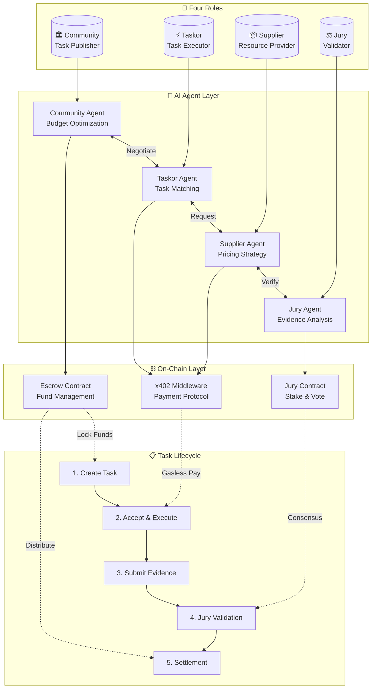
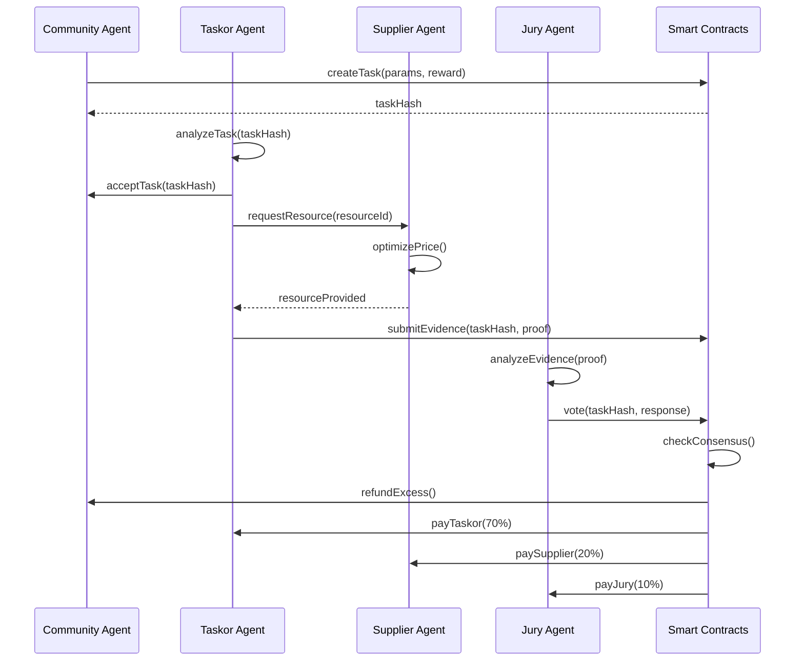
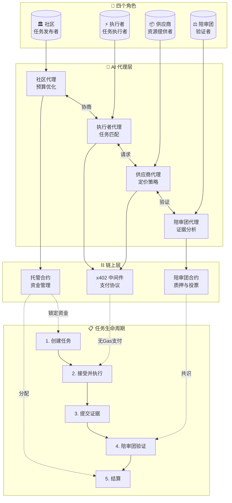
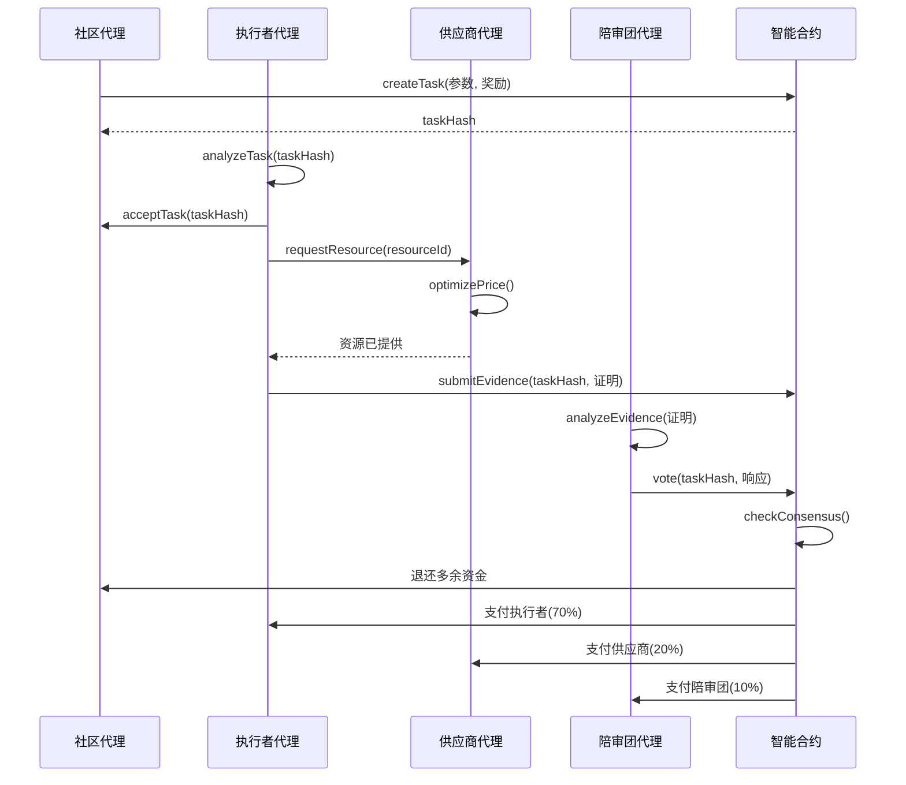

# MyTask

[](https://opensource.org/licenses/MIT)
[](https://soliditylang.org/)
[](https://getfoundry.sh/)
[](https://www.x402.org/)
[](https://eips.ethereum.org/EIPS/eip-8004)
[](https://langchain-ai.github.io/langgraph/)

AI-powered, permissionless task marketplace built on x402 protocol with four-party economic model.

## Architecture Overview



## Four-Party Economic Model

| Role | Responsibility | AI Agent Function | Incentive |
|------|----------------|-------------------|-----------|
| **Community** | Publish & fund tasks | Budget optimization, risk assessment | Task completion value |
| **Taskor** | Execute tasks | Task matching, execution planning | Task reward (70%) |
| **Supplier** | Provide resources | Dynamic pricing, inventory management | Resource fee (20%) |
| **Jury** | Validate completion | Evidence analysis, consensus voting | Validation fee (10%) |

## Core Features

- **AI-Driven Automation**: Each role has an autonomous AI agent (LangGraph-based)
- **x402 Protocol**: HTTP-native payment with gasless UX via EIP-2612/EIP-712
- **Permissionless**: No gatekeeping; anyone can participate in any role
- **Multi-Token Support**: Any ERC-20 following OpenPNTs protocol
- **On-Chain Settlement**: Transparent escrow with dispute resolution
- **Jury Consensus**: Stake-weighted voting for task validation

## Agent Interaction Flow



## Technology Stack

| Layer | Technology |
|-------|------------|
| Smart Contracts | Solidity (Foundry) |
| AI Agents | LangGraph + LLM (OpenAI/DeepSeek) |
| Payment Protocol | x402 + EIP-2612 (Gasless) |
| Identity | ERC-8004 Validation Registry |

## Project Structure

```
MyTask/
├── contracts/           # Foundry smart contracts
│   ├── src/
│   │   ├── JuryContract.sol
│   │   └── interfaces/
│   ├── test/
│   └── lib/forge-std/
├── docs/                # Architecture & analysis
└── submodules/          # Reference implementations
```

## Quick Start

```bash
# Install dependencies
cd contracts && forge install

# Run tests
forge test

# Deploy (local)
forge script script/Deploy.s.sol --rpc-url localhost:8545
```

## Documentation

| Document | Description |
|----------|-------------|
| [Architecture Synthesis](docs/REFERENCE-ARCHITECTURE-SYNTHESIS.md) | Complete system design |
| [Integration Guide](docs/INTEGRATION-QUICK-START.md) | Quick start for developers |
| [ADRs](docs/ARCHITECTURE-DECISION-RECORDS.md) | Key design decisions |
| [PayBot Analysis](docs/PayBot-Core-Abstraction-Analysis.md) | Gasless payment deep-dive |
| [Hubble Integration](docs/HubbleAITrading-Integration-Solution.md) | Multi-agent architecture |

## Inspiration

Built upon research from:
- [Payload Exchange](https://github.com/microchipgnu/payload-exchange) - x402 payment proxy
- [Hubble AI Trading](https://github.com/HubbleVision/hubble-ai-trading) - Multi-agent system
- [PayBot](https://github.com/superposition/paybot) - Gasless middleware
- [Halo](https://github.com/humanlabs-kr/halo) - Decentralized infrastructure

## License

MIT License - Open source and permissionless.

---

# MyTask (中文版)

[](https://opensource.org/licenses/MIT)
[](https://soliditylang.org/)
[](https://getfoundry.sh/)
[](https://www.x402.org/)
[](https://eips.ethereum.org/EIPS/eip-8004)
[](https://langchain-ai.github.io/langgraph/)

基于 x402 协议的 AI 驱动、无许可任务市场，采用四方经济模型。

## 架构概览



## 四方经济模型

| 角色 | 职责 | AI 代理功能 | 激励 |
|------|------|-------------|------|
| **社区 (Community)** | 发布并资助任务 | 预算优化、风险评估 | 任务完成价值 |
| **执行者 (Taskor)** | 执行任务 | 任务匹配、执行规划 | 任务奖励 (70%) |
| **供应商 (Supplier)** | 提供资源 | 动态定价、库存管理 | 资源费用 (20%) |
| **陪审团 (Jury)** | 验证完成情况 | 证据分析、共识投票 | 验证费用 (10%) |

## 核心特性

- **AI 驱动自动化**：每个角色都有自主 AI 代理（基于 LangGraph）
- **x402 协议**：HTTP 原生支付，通过 EIP-2612/EIP-712 实现无 Gas 体验
- **无许可**：无门槛，任何人都可以参与任何角色
- **多代币支持**：支持任何遵循 OpenPNTs 协议的 ERC-20 代币
- **链上结算**：透明托管与争议解决
- **陪审团共识**：基于质押权重的投票验证

## 代理交互流程



## 技术栈

| 层级 | 技术 |
|------|------|
| 智能合约 | Solidity (Foundry) |
| AI 代理 | LangGraph + LLM (OpenAI/DeepSeek) |
| 支付协议 | x402 + EIP-2612 (无Gas) |
| 身份验证 | ERC-8004 验证注册表 |

## 项目结构

```
MyTask/
├── contracts/           # Foundry 智能合约
│   ├── src/
│   │   ├── JuryContract.sol      # 陪审团合约
│   │   ├── TaskEscrow.sol        # 任务托管合约
│   │   └── interfaces/           # 接口定义
│   ├── test/                     # 测试文件
│   └── lib/forge-std/            # Foundry 标准库
├── docs/                         # 架构与分析文档
└── submodules/                   # 参考实现
```

## 快速开始

```bash
# 安装依赖
cd contracts && forge install

# 运行测试
forge test

# 部署（本地）
forge script script/Deploy.s.sol --rpc-url localhost:8545
```

## 文档

| 文档 | 描述 |
|------|------|
| [架构综合指南](docs/REFERENCE-ARCHITECTURE-SYNTHESIS.md) | 完整系统设计 |
| [集成快速指南](docs/INTEGRATION-QUICK-START.md) | 开发者快速入门 |
| [架构决策记录](docs/ARCHITECTURE-DECISION-RECORDS.md) | 关键设计决策 |
| [PayBot 分析](docs/PayBot-Core-Abstraction-Analysis.md) | 无 Gas 支付深度分析 |
| [Hubble 集成](docs/HubbleAITrading-Integration-Solution.md) | 多代理架构 |

## 灵感来源

基于以下项目的研究成果：
- [Payload Exchange](https://github.com/microchipgnu/payload-exchange) - x402 支付代理
- [Hubble AI Trading](https://github.com/HubbleVision/hubble-ai-trading) - 多代理系统
- [PayBot](https://github.com/superposition/paybot) - 无 Gas 中间件
- [Halo](https://github.com/humanlabs-kr/halo) - 去中心化基础设施

## 许可证

MIT 许可证 - 开源且无许可限制。
