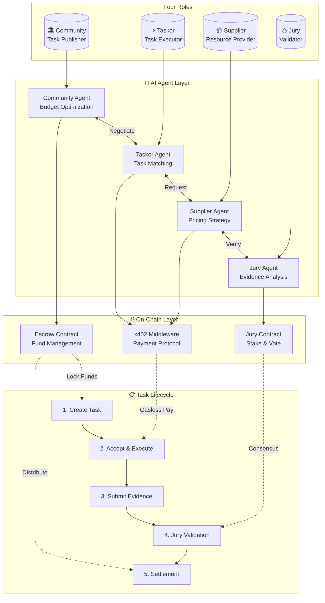
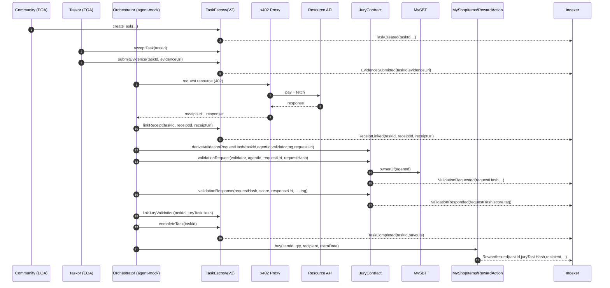
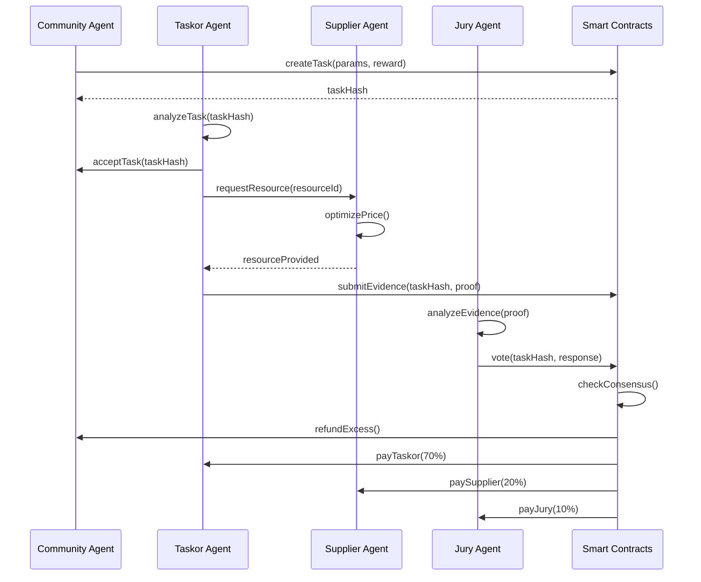
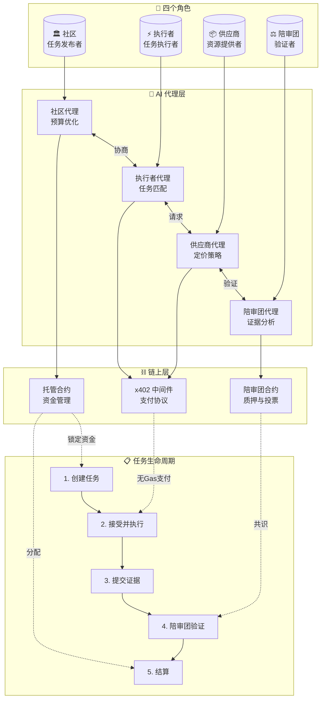
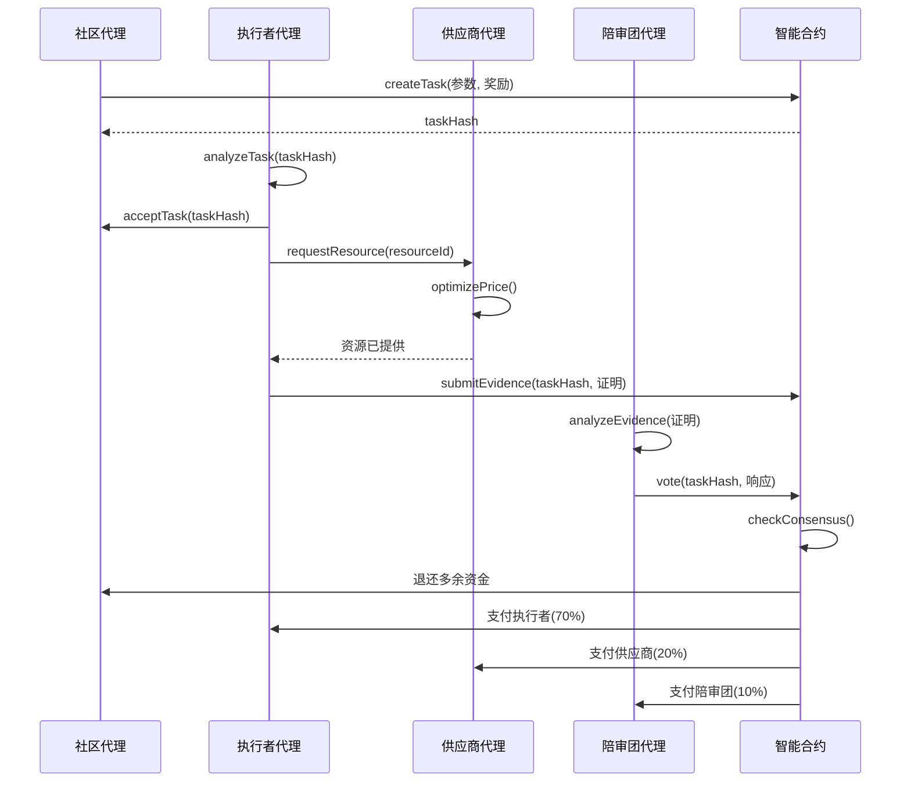

# MyTask

[](https://opensource.org/licenses/Apache-2.0)
[](https://soliditylang.org/)
[](https://getfoundry.sh/)
[](https://www.x402.org/)
[](https://eips.ethereum.org/EIPS/eip-8004)
[](https://langchain-ai.github.io/langgraph/)

AI-powered, permissionless task marketplace built on x402 protocol with four-party economic model.

## Architecture Overview


```mermaid
flowchart TB
    subgraph Users["👥 Four Roles"]
        S[("🏛️ Community<br/>Task Publisher")]
        T[("⚡ Taskor<br/>Task Executor")]
        P[("📦 Supplier<br/>Resource Provider")]
        J[("⚖️ Jury<br/>Validator")]
    end

    subgraph Agents["🤖 AI Agent Layer"]
        SA["Community Agent<br/>Budget Optimization"]
        TA["Taskor Agent<br/>Task Matching"]
        PA["Supplier Agent<br/>Pricing Strategy"]
        JA["Jury Agent<br/>Evidence Analysis"]
    end

    subgraph Chain["⛓️ On-Chain Layer"]
        ESC["Escrow Contract<br/>Fund Management"]
        JURY["Jury Contract<br/>Stake & Vote"]
        X402["x402 Middleware<br/>Payment Protocol"]
    end

    subgraph Flow["📋 Task Lifecycle"]
        F1["1. Create Task"]
        F2["2. Accept & Execute"]
        F3["3. Submit Evidence"]
        F4["4. Jury Validation"]
        F5["5. Settlement"]
    end

    S --> SA
    T --> TA
    P --> PA
    J --> JA

    SA <-->|"Negotiate"| TA
    TA <-->|"Request"| PA
    PA <-->|"Verify"| JA

    SA --> ESC
    TA --> X402
    PA --> X402
    JA --> JURY

    F1 --> F2 --> F3 --> F4 --> F5
    ESC -.->|"Lock Funds"| F1
    X402 -.->|"Gasless Pay"| F2
    JURY -.->|"Consensus"| F4
    ESC -.->|"Distribute"| F5
```

## System Architecture (Simple)

```mermaid
flowchart LR
  subgraph Offchain["Offchain (Agent Runtime + Services)"]
    ORCH["Orchestrator<br/>agent-mock/gasless-link-jury-validation.js"]
    IDX["Indexer + Dashboard<br/>agent-mock/indexer.js"]
    XPROXY["x402 Proxy + Receipt Store<br/>agent-mock/x402-proxy.js"]
    STORE["Offchain URIs<br/>IPFS/HTTP"]
  end

  subgraph Onchain["Onchain (MyTask + MyShop)"]
    ESCROW["TaskEscrow / TaskEscrowV2<br/>task lifecycle + settlement"]
    JURY["JuryContract<br/>ERC-8004 validations + jury voting"]
    SBT["MySBT<br/>agentId → owner"]
    SHOP["MyShopItems + RewardAction<br/>reward trigger + event"]
  end

  ORCH -->|writes txs| ESCROW
  ORCH -->|validationRequest/Response| JURY
  JURY -->|ownerOf(agentId)| SBT

  ORCH -->|pays 402| XPROXY -->|receiptUri| ORCH
  ORCH -->|links receipts / stores URIs| STORE

  ESCROW -->|events| IDX
  JURY -->|events| IDX
  SHOP -->|RewardIssued| IDX
  ORCH -->|reward trigger (EOA payer)| SHOP
```

## Main Components (Structure)

```mermaid
flowchart TB
  subgraph Contracts["Contracts (Foundry)"]
    ESC["TaskEscrowV2"]
    ESC1["TaskEscrow"]
    JR["JuryContract"]
    SBT["MySBT"]
  end

  subgraph AgentMock["agent-mock (Node + viem)"]
    ORCH["orchestrateTasks<br/>task automation"]
    IDX["indexer<br/>JSON state + dashboard"]
    X402["x402-proxy<br/>payments + receipts"]
  end

  subgraph External["External / Other Repos"]
    SHOP["MyShop (MyShopItems + RewardAction)"]
    RES["x402-protected resources<br/>(APIs/tools/data)"]
  end

  ORCH -->|create/accept/submit/link/complete| ESC
  ORCH -->|createTask/submitEvidence/vote/finalize| JR
  JR -->|MySBT.ownerOf(agentId)| SBT
  ORCH -->|buy(...extraData)| SHOP
  X402 <-->|402 challenge/receipt| RES

  ESC -->|events| IDX
  JR -->|events| IDX
  SHOP -->|events| IDX
  ORCH -->|calls| X402
```

## End-to-End Workflow (Tasks + x402 + ERC-8004 + Rewards)


```mermaid
sequenceDiagram
  autonumber
  participant Community as Community (EOA)
  participant Taskor as Taskor (EOA)
  participant Orchestrator as Orchestrator (agent-mock)
  participant Escrow as TaskEscrow(V2)
  participant X402 as x402 Proxy
  participant Resource as Resource API
  participant Jury as JuryContract
  participant MySBT as MySBT
  participant Shop as MyShopItems/RewardAction
  participant Indexer as Indexer

  Community->>Escrow: createTask(...)
  Escrow-->>Indexer: TaskCreated(taskId,...)
  Taskor->>Escrow: acceptTask(taskId)
  Taskor->>Escrow: submitEvidence(taskId, evidenceUri)
  Escrow-->>Indexer: EvidenceSubmitted(taskId,evidenceUri)

  Orchestrator->>X402: request resource (402)
  X402->>Resource: pay + fetch
  Resource-->>X402: response
  X402-->>Orchestrator: receiptUri + response
  Orchestrator->>Escrow: linkReceipt(taskId, receiptId, receiptUri)
  Escrow-->>Indexer: ReceiptLinked(taskId, receiptId, receiptUri)

  Orchestrator->>Jury: deriveValidationRequestHash(taskId,agentId,validator,tag,requestUri)
  Orchestrator->>Jury: validationRequest(validator, agentId, requestUri, requestHash)
  Jury->>MySBT: ownerOf(agentId)
  Jury-->>Indexer: ValidationRequested(requestHash,...)
  Orchestrator->>Jury: validationResponse(requestHash, score, responseUri, ..., tag)
  Jury-->>Indexer: ValidationResponded(requestHash,score,tag)

  Orchestrator->>Escrow: linkJuryValidation(taskId, juryTaskHash)
  Orchestrator->>Escrow: completeTask(taskId)
  Escrow-->>Indexer: TaskCompleted(taskId,payouts)

  Orchestrator->>Shop: buy(itemId, qty, recipient, extraData)
  Shop-->>Indexer: RewardIssued(taskId,juryTaskHash,recipient,...)
```

## Four-Party Economic Model

| Role | Responsibility | AI Agent Function | Incentive |
|------|----------------|-------------------|-----------|
| **Community** | Publish & fund tasks | Budget optimization, risk assessment | Task completion value |
| **Taskor** | Execute tasks | Task matching, execution planning | Task reward (70%) |
| **Supplier** | Provide resources | Dynamic pricing, inventory management | Resource fee (20%) |
| **Jury** | Validate completion | Evidence analysis, consensus voting | Validation fee (10%) |

## Core Features

- **AI-Driven Automation**: Each role has an autonomous AI agent (LangGraph-based)
- **x402 Protocol**: HTTP-native payment with gasless UX via EIP-2612/EIP-712
- **Permissionless**: No gatekeeping; anyone can participate in any role
- **Multi-Token Support**: Any ERC-20 following OpenPNTs protocol
- **On-Chain Settlement**: Transparent escrow with dispute resolution
- **Jury Consensus**: Stake-weighted voting for task validation

## Implemented Features (2026-02-12)

- **Single source of truth review doc**: `docs/TotalSolution.md` (milestones M1-M5, code anchors, reproducible evidence)
- **Registry 4-role configuration (JURY/PUBLISHER/TASKER/SUPPLIER)**: SuperPaymaster `contracts/script/v3/ConfigureMyTaskRoles.s.sol`
- **Escrow payout fix (no leftover funds)**: when `supplier != 0` but `supplierFee < cap`, unused supplierShare is redistributed (TaskEscrow + TaskEscrowV2)
- **Items+Actions reward with traceability**: MyShop `RewardAction` emits `RewardIssued(taskId, juryTaskHash, recipient, ...)`
- **Event-driven gasless agent mock**: aastar-sdk example watches on-chain events and submits gasless userOps (PaymasterClient)

## New Features (2026-02-13)

- **ERC-8004 canonical JSON schemas**: `docs/schemas/erc8004-validation-*.schema.json`
- **x402 receipt schema**: `docs/schemas/x402-receipt.schema.json`
- **Local x402 proxy (dashboard + hardening)**: `agent-mock/x402-proxy.js` + `agent-mock/sponsor-policy.json`
  - Dashboard: `GET /`, `GET /stats`, `GET /receipts`
  - Abuse prevention: `X402_RATE_LIMIT_IP`, `X402_RATE_LIMIT_PAYER`, `X402_RATE_WINDOW_MS`, `X402_MAX_BODY_BYTES`
  - Storage hardening: atomic writes + corruption recovery for `accounting.json`
- **Validation + receipts indexer (events → JSON state + dashboard)**: `agent-mock/indexer.js`
  - Dashboard: `node indexer.js --serve true --port 8790` (also exposes `/tasks`, `/validations`, `/agents`, `/alerts`)
  - Reputation snapshot: `GET /reputation/:agentId` returns `{ reputation, canonical, digest }` for portable verification
- **Task orchestrator demo (structured logs)**: `agent-mock/gasless-link-jury-validation.js --mode orchestrateTasks` (logs include `ts` + `event`)
- **Foundry invariants (TaskEscrowV2)**: `contracts/test/TaskEscrowV2.invariant.t.sol`

## New Features (2026-02-14)

- **M5 reward trigger via EOA payer**: `orchestrateTasks` now uses an EOA payer (no AA assets needed yet) and persists the reward tx into indexer state.
- **TaskId mismatch prevention**: demo/deploy flows derive the on-chain `taskId` via `getTasksByCommunity`.
- **Owner-bound validations**: `enforceAgentOwner` is back on by default by deploying/pointing to a real `MySBT`.
- **ERC-8004 determinism locked**: `requestHash != 0` enforcement enabled by default, plus an end-to-end demo path in `Deploy.s.sol`.

## Agent Interaction Flow


```mermaid
sequenceDiagram
    participant S as Community Agent
    participant T as Taskor Agent
    participant P as Supplier Agent
    participant J as Jury Agent
    participant C as Smart Contracts

    S->>C: createTask(params, reward)
    C-->>S: taskHash

    T->>T: analyzeTask(taskHash)
    T->>S: acceptTask(taskHash)

    T->>P: requestResource(resourceId)
    P->>P: optimizePrice()
    P-->>T: resourceProvided

    T->>C: submitEvidence(taskHash, proof)

    J->>J: analyzeEvidence(proof)
    J->>C: vote(taskHash, response)

    C->>C: checkConsensus()
    C->>S: refundExcess()
    C->>T: payTaskor(70%)
    C->>P: paySupplier(20%)
    C->>J: payJury(10%)
```

## Technology Stack

| Layer | Technology |
|-------|------------|
| Smart Contracts | Solidity (Foundry) |
| AI Agents | LangGraph + LLM (OpenAI/DeepSeek) |
| Payment Protocol | x402 + EIP-2612 (Gasless) |
| Identity | ERC-8004 Validation Registry |

## Project Structure

```
MyTask/
├── contracts/           # Foundry smart contracts
│   ├── src/
│   │   ├── JuryContract.sol
│   │   └── interfaces/
│   ├── test/
│   └── lib/forge-std/
├── docs/                # Architecture & analysis
└── submodules/          # Reference implementations
```

## Quick Start

```bash
# Install dependencies
cd contracts && forge install

# Run tests
forge test

# Deploy (local)
forge script script/Deploy.s.sol --rpc-url localhost:8545
```

## Run Local Demo (x402 receipts + validations + orchestration)

```bash
# 1) Start local chain (in a separate terminal)
anvil -p 8545

# 2) Deploy contracts (captures TaskEscrow + Jury addresses in broadcast output)
cd contracts
forge script script/Deploy.s.sol --rpc-url http://localhost:8545 --broadcast

# 3) Install agent-mock deps
cd ../agent-mock
npm install

# 4) Start local x402 proxy (writes receipts under agent-mock/receipts/)
npm run x402:proxy
```

Create `.env` at the repo root (required by agent-mock):

```bash
RPC_URL=http://localhost:8545
CHAIN_ID=31337
TASK_ESCROW_ADDRESS=0x...
JURY_CONTRACT_ADDRESS=0x...
PRIVATE_KEY=0x...
COMMUNITY_PRIVATE_KEY=0x...            # optional (defaults to PRIVATE_KEY)
VALIDATOR_PRIVATE_KEY=0x...            # optional (defaults to PRIVATE_KEY)
X402_PROXY_URL=http://localhost:8787   # optional (enables auto receipt generation)
```

Run the orchestrator (watches `TaskCreated` and drives accept → submit → receipts → validations → finalize):

```bash
cd agent-mock
npm run orchestrateTasks -- \
  --once true \
  --agentId 1 \
  --validationMinCount 1 \
  --validationTag QUALITY \
  --x402TaskAmount 1 \
  --x402ValidationAmount 1
```

Index events into a compact JSON snapshot (tasks + receipts + validations + per-agent aggregates):

```bash
cd agent-mock
npm run index -- --out out/index.json
```

Fetch a portable reputation snapshot (canonical JSON + digest):

```bash
curl http://localhost:8790/reputation/1
```

## Documentation

| Document | Description |
|----------|-------------|
| [Architecture Synthesis](docs/REFERENCE-ARCHITECTURE-SYNTHESIS.md) | Complete system design |
| [Integration Guide](docs/INTEGRATION-QUICK-START.md) | Quick start for developers |
| [ADRs](docs/ARCHITECTURE-DECISION-RECORDS.md) | Key design decisions |
| [Reputation Snapshot](docs/ReputationSnapshot.md) | Canonical payload and digest verification |
| [PayBot Analysis](docs/PayBot-Core-Abstraction-Analysis.md) | Gasless payment deep-dive |
| [Hubble Integration](docs/HubbleAITrading-Integration-Solution.md) | Multi-agent architecture |

## Inspiration

Built upon research from:
- [Payload Exchange](https://github.com/microchipgnu/payload-exchange) - x402 payment proxy
- [Hubble AI Trading](https://github.com/HubbleVision/hubble-ai-trading) - Multi-agent system
- [PayBot](https://github.com/superposition/paybot) - Gasless middleware
- [Halo](https://github.com/humanlabs-kr/halo) - Decentralized infrastructure

## License

MIT License - Open source and permissionless.

---

# MyTask (中文版)

[](https://opensource.org/licenses/MIT)
[](https://soliditylang.org/)
[](https://getfoundry.sh/)
[](https://www.x402.org/)
[](https://eips.ethereum.org/EIPS/eip-8004)
[](https://langchain-ai.github.io/langgraph/)

基于 x402 协议的 AI 驱动、无许可任务市场，采用四方经济模型。

## 已实现特性（2026-02-12）

- **单一评审文档**：`docs/TotalSolution.md`（M1-M5、代码锚点、可复现实证）
- **四角色 Registry 配置**：SuperPaymaster `contracts/script/v3/ConfigureMyTaskRoles.s.sol`（JURY/PUBLISHER/TASKER/SUPPLIER）
- **Escrow 结算语义修复（无余额残留）**：supplier 已设置但 supplierFee 未打满上限时，未用完 supplierShare 自动再分配（TaskEscrow + TaskEscrowV2）
- **Items+Actions 奖励强绑定**：MyShop `RewardAction` 事件 `RewardIssued(taskId, juryTaskHash, recipient, ...)`
- **事件驱动的 Gasless Agent Mock**：aastar-sdk 示例订阅事件并提交 gasless userOp（PaymasterClient）

## 新增特性（2026-02-13）

- **ERC-8004 验证请求/响应 JSON Schema**：`docs/schemas/erc8004-validation-*.schema.json`
- **x402 回执 JSON Schema**：`docs/schemas/x402-receipt.schema.json`
- **本地 x402 Proxy（Dashboard + 加固）**：`agent-mock/x402-proxy.js` + `agent-mock/sponsor-policy.json`
  - Dashboard：`GET /`, `GET /stats`, `GET /receipts`
  - 防滥用参数：`X402_RATE_LIMIT_IP`, `X402_RATE_LIMIT_PAYER`, `X402_RATE_WINDOW_MS`, `X402_MAX_BODY_BYTES`
  - 存储加固：`accounting.json` 原子写入 + 破损自动恢复
- **验证与回执索引器（events → JSON state + Dashboard）**：`agent-mock/indexer.js`
  - Dashboard：`node indexer.js --serve true --port 8790`（也提供 `/tasks`, `/validations`, `/agents`, `/alerts`）
  - 信誉快照：`GET /reputation/:agentId` 返回 `{ reputation, canonical, digest }`，便于跨环境校验
- **任务编排 Demo（结构化日志）**：`agent-mock/gasless-link-jury-validation.js --mode orchestrateTasks`（日志包含 `ts` + `event`）
- **Foundry Invariant 测试（TaskEscrowV2）**：`contracts/test/TaskEscrowV2.invariant.t.sol`

## 新增特性（2026-02-14）

- **M5 奖励触发走 EOA 付款**：`orchestrateTasks` 使用 EOA payer（暂不依赖 AA 账户资产），并将奖励交易写入 indexer state。
- **修复 taskId 不匹配**：demo/deploy 流通过 `getTasksByCommunity` 推导链上真实 `taskId`。
- **验证严格绑定 owner**：默认部署/指向真实 `MySBT`，并恢复开启 `enforceAgentOwner`。
- **锁定 ERC-8004 确定性**：默认开启 `requestHash != 0` 强制校验，并在 `Deploy.s.sol` 里提供端到端演示路径。

## 架构概览


```mermaid
flowchart TB
    subgraph Users["👥 四个角色"]
        S[("🏛️ 社区<br/>任务发布者")]
        T[("⚡ 执行者<br/>任务执行者")]
        P[("📦 供应商<br/>资源提供者")]
        J[("⚖️ 陪审团<br/>验证者")]
    end

    subgraph Agents["🤖 AI 代理层"]
        SA["社区代理<br/>预算优化"]
        TA["执行者代理<br/>任务匹配"]
        PA["供应商代理<br/>定价策略"]
        JA["陪审团代理<br/>证据分析"]
    end

    subgraph Chain["⛓️ 链上层"]
        ESC["托管合约<br/>资金管理"]
        JURY["陪审团合约<br/>质押与投票"]
        X402["x402 中间件<br/>支付协议"]
    end

    subgraph Flow["📋 任务生命周期"]
        F1["1. 创建任务"]
        F2["2. 接受并执行"]
        F3["3. 提交证据"]
        F4["4. 陪审团验证"]
        F5["5. 结算"]
    end

    S --> SA
    T --> TA
    P --> PA
    J --> JA

    SA <-->|"协商"| TA
    TA <-->|"请求"| PA
    PA <-->|"验证"| JA

    SA --> ESC
    TA --> X402
    PA --> X402
    JA --> JURY

    F1 --> F2 --> F3 --> F4 --> F5
    ESC -.->|"锁定资金"| F1
    X402 -.->|"无Gas支付"| F2
    JURY -.->|"共识"| F4
    ESC -.->|"分配"| F5
```

## 系统架构（简图）

```mermaid
flowchart LR
  subgraph Offchain["链下（Agent Runtime + Services）"]
    ORCH["Orchestrator<br/>agent-mock/gasless-link-jury-validation.js"]
    IDX["Indexer + Dashboard<br/>agent-mock/indexer.js"]
    XPROXY["x402 Proxy + Receipt Store<br/>agent-mock/x402-proxy.js"]
    STORE["链下 URI<br/>IPFS/HTTP"]
  end

  subgraph Onchain["链上（MyTask + MyShop）"]
    ESCROW["TaskEscrow / TaskEscrowV2<br/>任务生命周期 + 结算"]
    JURY["JuryContract<br/>ERC-8004 验证 + Jury 投票"]
    SBT["MySBT<br/>agentId → owner"]
    SHOP["MyShopItems + RewardAction<br/>奖励触发 + 事件"]
  end

  ORCH -->|写链上交易| ESCROW
  ORCH -->|validationRequest/Response| JURY
  JURY -->|ownerOf(agentId)| SBT

  ORCH -->|支付 402| XPROXY -->|receiptUri| ORCH
  ORCH -->|挂接回执 / 存储 URI| STORE

  ESCROW -->|events| IDX
  JURY -->|events| IDX
  SHOP -->|RewardIssued| IDX
  ORCH -->|奖励触发（EOA payer）| SHOP
```

## 组件结构（主关系）

```mermaid
flowchart TB
  subgraph Contracts["合约（Foundry）"]
    ESC["TaskEscrowV2"]
    ESC1["TaskEscrow"]
    JR["JuryContract"]
    SBT["MySBT"]
  end

  subgraph AgentMock["agent-mock（Node + viem）"]
    ORCH["orchestrateTasks<br/>任务自动化"]
    IDX["indexer<br/>JSON state + dashboard"]
    X402["x402-proxy<br/>支付 + 回执"]
  end

  subgraph External["外部 / 其他 Repo"]
    SHOP["MyShop（MyShopItems + RewardAction）"]
    RES["x402 保护的资源<br/>(API/工具/数据)"]
  end

  ORCH -->|create/accept/submit/link/complete| ESC
  ORCH -->|validationRequest/Response| JR
  JR -->|MySBT.ownerOf(agentId)| SBT
  ORCH -->|buy(...extraData)| SHOP
  X402 <-->|402 挑战/receipt| RES

  ESC -->|events| IDX
  JR -->|events| IDX
  SHOP -->|events| IDX
  ORCH -->|calls| X402
```

## 四方经济模型

| 角色 | 职责 | AI 代理功能 | 激励 |
|------|------|-------------|------|
| **社区 (Community)** | 发布并资助任务 | 预算优化、风险评估 | 任务完成价值 |
| **执行者 (Taskor)** | 执行任务 | 任务匹配、执行规划 | 任务奖励 (70%) |
| **供应商 (Supplier)** | 提供资源 | 动态定价、库存管理 | 资源费用 (20%) |
| **陪审团 (Jury)** | 验证完成情况 | 证据分析、共识投票 | 验证费用 (10%) |

## 核心特性

- **AI 驱动自动化**：每个角色都有自主 AI 代理（基于 LangGraph）
- **x402 协议**：HTTP 原生支付，通过 EIP-2612/EIP-712 实现无 Gas 体验
- **无许可**：无门槛，任何人都可以参与任何角色
- **多代币支持**：支持任何遵循 OpenPNTs 协议的 ERC-20 代币
- **链上结算**：透明托管与争议解决
- **陪审团共识**：基于质押权重的投票验证

## 代理交互流程


```mermaid
sequenceDiagram
    participant S as 社区代理
    participant T as 执行者代理
    participant P as 供应商代理
    participant J as 陪审团代理
    participant C as 智能合约

    S->>C: createTask(参数, 奖励)
    C-->>S: taskHash

    T->>T: analyzeTask(taskHash)
    T->>S: acceptTask(taskHash)

    T->>P: requestResource(resourceId)
    P->>P: optimizePrice()
    P-->>T: 资源已提供

    T->>C: submitEvidence(taskHash, 证明)

    J->>J: analyzeEvidence(证明)
    J->>C: vote(taskHash, 响应)

    C->>C: checkConsensus()
    C->>S: 退还多余资金
    C->>T: 支付执行者(70%)
    C->>P: 支付供应商(20%)
    C->>J: 支付陪审团(10%)
```

## 技术栈

| 层级 | 技术 |
|------|------|
| 智能合约 | Solidity (Foundry) |
| AI 代理 | LangGraph + LLM (OpenAI/DeepSeek) |
| 支付协议 | x402 + EIP-2612 (无Gas) |
| 身份验证 | ERC-8004 验证注册表 |

## 项目结构

```
MyTask/
├── contracts/           # Foundry 智能合约
│   ├── src/
│   │   ├── JuryContract.sol      # 陪审团合约
│   │   ├── TaskEscrow.sol        # 任务托管合约
│   │   └── interfaces/           # 接口定义
│   ├── test/                     # 测试文件
│   └── lib/forge-std/            # Foundry 标准库
├── docs/                         # 架构与分析文档
└── submodules/                   # 参考实现
```

## 快速开始

```bash
# 安装依赖
cd contracts && forge install

# 运行测试
forge test

# 部署（本地）
forge script script/Deploy.s.sol --rpc-url localhost:8545
```

## 文档

| 文档 | 描述 |
|------|------|
| [架构综合指南](docs/REFERENCE-ARCHITECTURE-SYNTHESIS.md) | 完整系统设计 |
| [集成快速指南](docs/INTEGRATION-QUICK-START.md) | 开发者快速入门 |
| [架构决策记录](docs/ARCHITECTURE-DECISION-RECORDS.md) | 关键设计决策 |
| [PayBot 分析](docs/PayBot-Core-Abstraction-Analysis.md) | 无 Gas 支付深度分析 |
| [Hubble 集成](docs/HubbleAITrading-Integration-Solution.md) | 多代理架构 |

## 灵感来源

基于以下项目的研究成果：
- [Payload Exchange](https://github.com/microchipgnu/payload-exchange) - x402 支付代理
- [Hubble AI Trading](https://github.com/HubbleVision/hubble-ai-trading) - 多代理系统
- [PayBot](https://github.com/superposition/paybot) - 无 Gas 中间件
- [Halo](https://github.com/humanlabs-kr/halo) - 去中心化基础设施

## 许可证

MIT 许可证 - 开源且无许可限制。
