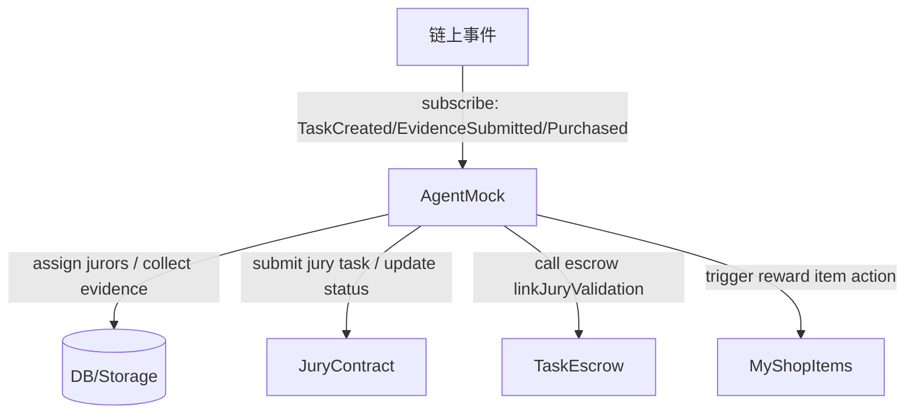

# TotalSolution（v0.2）
## AAStar 四角色注册 / 陪审质押 / Gasless 代付 / Items+Actions 激励 / 外部 Agent（Mock）—— 单一评审文档

- 更新时间：2026-02-12
- 覆盖仓库：
  - SuperPaymaster（Registry/MySBT/Paymaster 系统）
  - aastar-sdk（Registry/MySBT/Gasless API 封装）
  - MyShop（Items + Actions 原子化激励）
  - MyTask（TaskEscrow/JuryContract 任务托管与仲裁）

## 目录

1. 背景与目标
2. 术语表（含 Escrow）
3. 当前基线与关键代码参考
4. 角色与权限模型（四角色 + EndUser 基座）
5. 关键流程（流程图式文字）
6. 关键接口清单（合约 / SDK / 外部服务）
7. 里程碑计划（合并旧 5 项目标）
8. 风险与待定项
9. 可验证证据（本地命令输出 + 代码锚点）

## 1. 背景与目标

目标是把「任务发布—接单执行—（可选）供应商协作—陪审验证—结算激励」跑成闭环，并且：

- 四个业务角色：陪审员（Jury）、发布者/社区（Publisher/Community）、接单者（Tasker）、供应商（Supplier）
- 身份入口约束：ENDUSER 依赖 COMMUNITY（加入某个社区）；COMMUNITY 本身可直接注册，不需要先成为 ENDUSER
- 再按需要升级为业务角色（Jury/Publisher/Tasker/Supplier），并支持管理员配置不同角色的质押与退出费等参数
- Gasless 代付：业务侧通过 aastar-sdk 的 gasless API 发起无 gas 交易，底层走 SuperPaymaster 合约体系
- 外部 Agent：链外服务（Mock）承接编排与自动化，不绑定具体框架（不依赖 LangGraph 等）
- 陪审激励：用 MyShop 的 Items + Actions 模式实现“奖励发放 + 业务动作”原子化（供应商=shop，上架带 action 的奖励商品）

## 2. 术语表（含 Escrow）

- Escrow：托管 / 第三方托管 / 资金托管。链上通常指「托管合约」：资金先锁定在合约中，满足条件后再释放给对应方。
- COMMUNITY：Registry 的社区角色，可直接注册；ENDUSER 注册时会校验 community 必须是已激活的 COMMUNITY。
- ENDUSER：Registry 的基础身份角色，代表“加入某社区的用户身份”。注：当前 Registry 合约未强制要求 JURY/TASKER/SUPPLIER/PUBLISHER 先具备 ENDUSER（如需强约束需要合约层或链外策略补齐）。
- Supplier（名词歧义）：MyTask/TaskEscrow 里的 Supplier 表示“协作/资源提供方（可选，领取 supplierFee）”；MyShop 里的 Supplier 表示“开店上架奖励商品的 shop 方”。两者不一定是同一主体。
- RoleConfig：Registry 中每个角色的配置（最小质押、进入 burn、退出费、是否激活、锁定期等）。
- Items + Actions：MyShop 的购买流程中，NFT mint 与 action 执行在同一笔交易内完成；任一环节失败整体回滚，保证原子性。
- Gasless：用户不直接支付 gas，由 Paymaster/Operator 系统代付，通过 AA UserOperation + Bundler 提交。

## 3. 当前基线与关键代码参考

由于代码索引尚未就绪，本次基线核对采用直接扫描文件与逐段阅读完成。

### 3.1 Registry（SuperPaymaster）

- Registry 合约主体：[Registry.sol](file:///Volumes/UltraDisk/Dev2/aastar/SuperPaymaster/contracts/src/core/Registry.sol)
  - 角色常量（含 ENDUSER/COMMUNITY）：[Registry.sol:L31-L39](file:///Volumes/UltraDisk/Dev2/aastar/SuperPaymaster/contracts/src/core/Registry.sol#L31-L39)
  - 统一注册入口 registerRole / registerRoleSelf / createNewRole / configureRole：
    - [Registry.sol:L194-L252](file:///Volumes/UltraDisk/Dev2/aastar/SuperPaymaster/contracts/src/core/Registry.sol#L194-L252)
    - [Registry.sol:L357-L413](file:///Volumes/UltraDisk/Dev2/aastar/SuperPaymaster/contracts/src/core/Registry.sol#L357-L413)
  - ENDUSER/COMMUNITY roleData 解码与 stake 提取逻辑（自定义角色默认用 uint256 stake 或走 minStake）：[Registry.sol:L600-L636](file:///Volumes/UltraDisk/Dev2/aastar/SuperPaymaster/contracts/src/core/Registry.sol#L600-L636)
- IRegistry RoleConfig 结构体（字段定义与语义）：[IRegistry.sol:L31-L48](file:///Volumes/UltraDisk/Dev2/aastar/SuperPaymaster/contracts/src/interfaces/v3/IRegistry.sol#L31-L48)

### 3.2 MySBT（SuperPaymaster）

- MySBT 接口（Registry 注册时 mintForRole / airdropMint 等）：[IMySBT.sol:L38-L55](file:///Volumes/UltraDisk/Dev2/aastar/SuperPaymaster/contracts/src/interfaces/v3/IMySBT.sol#L38-L55)

### 3.3 SDK（aastar-sdk）

- Registry SDK actions（createNewRole/registerRoleSelf/hasRole 等）：[registry.ts:L21-L99](file:///Volumes/UltraDisk/Dev2/aastar/aastar-sdk/packages/core/src/actions/registry.ts#L21-L99)
- EndUser 客户端：executeGasless（通过 PaymasterClient 提交 gasless UserOperation）：[UserClient.ts:L441-L530](file:///Volumes/UltraDisk/Dev2/aastar/aastar-sdk/packages/enduser/src/UserClient.ts#L441-L530)
- PaymasterClient：submitGaslessUserOperation（高阶 gasless 提交 API）：[PaymasterClient.ts:L249-L429](file:///Volumes/UltraDisk/Dev2/aastar/aastar-sdk/packages/paymaster/src/V4/PaymasterClient.ts#L249-L429)

### 3.4 MyShop（Items + Actions）

- Items + Actions 关键接口 IMyShopItemAction.execute： [MyShopItems.sol:L11-L21](file:///Volumes/UltraDisk/Dev2/aastar/MyShop/contracts/src/MyShopItems.sol#L11-L21)
- 购买 buy 原子流程（收款 → mint → executeAction → emit）：[MyShopItems.sol:L291-L341](file:///Volumes/UltraDisk/Dev2/aastar/MyShop/contracts/src/MyShopItems.sol#L291-L341)

### 3.5 MyTask（Escrow / Jury）

- 四方托管接口 ITaskEscrow（生命周期与资金分配语义）：[ITaskEscrow.sol:L15-L207](file:///Volumes/UltraDisk/Dev2/aastar/MyTask/contracts/src/interfaces/ITaskEscrow.sol#L15-L207)

## 4. 角色与权限模型（四角色 + EndUser 基座）

### 4.1 角色分层

- 社区入口：COMMUNITY（可直接注册）
- 用户基座：ENDUSER（加入某个 COMMUNITY 后获得）
- 业务角色（新增）：JURY / PUBLISHER（或 COMMUNITY 承载）/ TASKER / SUPPLIER

建议 roleId 约定（bytes32）：

- ROLE_JURY = keccak256("JURY")
- ROLE_PUBLISHER = keccak256("PUBLISHER")
- ROLE_TASKER = keccak256("TASKER")
- ROLE_SUPPLIER = keccak256("SUPPLIER")

### 4.2 权限边界

- 协议管理员（Registry owner）：
  - 创建新角色 createNewRole
  - 设置角色 owner、锁定期、必要的全局参数
- 角色 owner（roleOwners[roleId]）：
  - 可 configureRole（与 owner() 同权）调整 RoleConfig
- 普通用户：
  - registerRoleSelf 注册角色（前置：必须满足 stake 与业务约束）
  - exitRole 退出角色（受 lockDuration 与 exitFee 约束）

### 4.3 roleData 编码约定（对接 SDK 与链上校验）

- ENDUSER：Registry 侧会解码为 EndUserRoleData，并校验 community 必须已是 COMMUNITY 角色：[Registry.sol:L620-L636](file:///Volumes/UltraDisk/Dev2/aastar/SuperPaymaster/contracts/src/core/Registry.sol#L620-L636)
  - 推荐按合约 struct 编码（或按兼容 tuple 编码也可）：(account, community, avatarURI, ensName, stakeAmount)
- 自定义业务角色（JURY/TASKER/SUPPLIER/PUBLISHER）：
  - 现有 Registry 逻辑对非 ENDUSER/COMMUNITY 的 roleData：若长度=32 则解码为 uint256 stakeAmount；否则 stakeAmount 可能回落到 minStake
  - 因此建议第一版统一用 roleData = abi.encode(uint256 stakeAmount)，并由 RoleConfig.minStake 兜底

## 5. 关键流程（流程图式文字）

### 5.1 流程 A：管理员创建并配置四业务角色

```mermaid
flowchart TD
  Admin[Registry owner] -->|createNewRole(roleId, RoleConfig, roleOwner)| Registry
  Registry -->|setRoleExitFee(roleId, exitFeePercent, minExitFee)| Staking[GTokenStaking]
  roleOwner -->|configureRole(roleId, RoleConfig)| Registry
```

要点：

- createNewRole 是 owner-only，并会同步退出费到 staking：[Registry.sol:L401-L412](file:///Volumes/UltraDisk/Dev2/aastar/SuperPaymaster/contracts/src/core/Registry.sol#L401-L412)
- configureRole 允许 roleOwner 或 owner 调参，并同步退出费：[Registry.sol:L357-L364](file:///Volumes/UltraDisk/Dev2/aastar/SuperPaymaster/contracts/src/core/Registry.sol#L357-L364)

### 5.2 流程 B：注册 COMMUNITY 与 ENDUSER（加入社区的用户基座）

```mermaid
flowchart TD
  CommunityOwner -->|registerRoleSelf(ROLE_COMMUNITY, communityRoleData)| Registry
  User -->|registerRoleSelf(ROLE_ENDUSER, roleData)| Registry
  Registry -->|validate community is active| Registry
  Registry -->|lockStake & entryBurn| Staking[GTokenStaking]
  Registry -->|mintForRole(user, ROLE_ENDUSER, sbtData)| MySBT
  Registry -->|accountToUser[account]=user| Registry
```

要点：

- COMMUNITY 可以直接注册（Registry 未要求其先具备 ENDUSER）：[Registry.sol:L194-L213](file:///Volumes/UltraDisk/Dev2/aastar/SuperPaymaster/contracts/src/core/Registry.sol#L194-L213)
- ENDUSER roleData 要带 community 地址，Registry 会校验该 community 已注册 COMMUNITY 角色：[Registry.sol:L628-L631](file:///Volumes/UltraDisk/Dev2/aastar/SuperPaymaster/contracts/src/core/Registry.sol#L628-L631)
- 注册会触发 MySBT.mintForRole（第一次 mint，后续为 membership 更新）：[Registry.sol:L237-L246](file:///Volumes/UltraDisk/Dev2/aastar/SuperPaymaster/contracts/src/core/Registry.sol#L237-L246)

### 5.3 流程 C：陪审员质押注册（JURY）

```mermaid
flowchart TD
  User -->|optional: hasRole(ENDUSER)| Precheck
  User -->|registerRoleSelf(ROLE_JURY, abi.encode(stake))| Registry
  Registry -->|stake >= RoleConfig.minStake| Registry
  Registry -->|lockStake(user, ROLE_JURY)| Staking
  Registry -->|mintForRole(user, ROLE_JURY, ...)| MySBT
```

第一版约定：

- 当前 Registry 合约未强制陪审员必须先是 ENDUSER；如希望“陪审员必须加入某社区后才能质押注册”，需要补充约束（合约层检查 hasRole[ENDUSER][user] 或链外策略/前端限制）。
- JURY roleData 只承载 stake（uint256），具体“陪审档案/技能标签”放链外或 SBT metadata 扩展
- 陪审资格与陪审任务分配（JuryContract）由链外 Agent + 链上 JuryContract 双控推进

### 5.4 流程 D：任务托管 Escrow 生命周期（Community/Tasker/Supplier/Jury）

基于 MyTask 的 TaskEscrow 合约实现，默认 shares 为 taskor 70% / supplierShare 20% / jury 10%，但 supplier 并不是“固定拿 20%”：

- 有 supplier 时：supplier 领取的是 taskor 指定的 supplierFee（上限为 reward * supplierShare），并非固定 20%：[TaskEscrow.sol:L186-L203](file:///Volumes/UltraDisk/Dev2/aastar/MyTask/contracts/src/TaskEscrow.sol#L186-L203)
- 没有 supplier 时：supplierShare 会在 taskor 与 jury 之间按 70/30 重新分配：[TaskEscrow.sol:L352-L359](file:///Volumes/UltraDisk/Dev2/aastar/MyTask/contracts/src/TaskEscrow.sol#L352-L359)
- juryShare 默认是 10%，但不是“硬上限”：feeRecipient 可通过 setDistributionShares 全局调整三方 shares（要求总和=10000）：[TaskEscrow.sol:L374-L380](file:///Volumes/UltraDisk/Dev2/aastar/MyTask/contracts/src/TaskEscrow.sol#L374-L380)

```mermaid
flowchart TD
  Community -->|createTask(params)| Escrow[TaskEscrow]
  Tasker -->|acceptTask(taskId)| Escrow
  Tasker -->|assignSupplier(taskId, supplier, fee)| Escrow
  Tasker -->|submitEvidence(taskId, evidenceUri)| Escrow
  Agent -->|create/dispatch jury task| Jury[JuryContract]
  Jury -->|validate| Jury
  CommunityOrAgent -->|linkJuryValidation(taskId, juryTaskHash)| Escrow
  Escrow -->|completeTask(taskId)| Escrow
  Escrow -->|distribute funds| Tasker
  Escrow -->|distribute funds| Supplier
  Escrow -->|distribute funds| Jury
```

对接点（本文建议）：

- “陪审结果”应当最终落到 linkJuryValidation → completeTask 触发分账
- “陪审激励闭环”中的额外奖励（积分/NFT）不替代 escrow 分账，而是补贴与荣誉系统（由 MyShop items + actions 发放）
- 关于“Supplier 是否应该拿钱”的结论（基于当前代码）：在 MyTask 的当前实现里，Supplier 被建模为“协作/资源提供方（可选）”，从 Community 出资的 reward 中领取协商费用（supplierFee，上限为 supplierShare）。
- 重要语义坑（需要定案）：当前实现中，若设置了 supplier 但 supplierFee < supplierShare 上限，会导致 reward 有一部分未被分配（留在 escrow 合约里）。合约侧改造方向：自动把“未用完的 supplierShare”再分配/退回（建议作为 M3/M? 变更项的一部分）：[TaskEscrow.sol:L339-L362](file:///Volumes/UltraDisk/Dev2/aastar/MyTask/contracts/src/TaskEscrow.sol#L339-L362)

### 5.5 流程 E：陪审激励闭环（Supplier=Shop，奖励 Item + Action）

目标：把“供应商给任务方奖励（NFT+积分）+ 陪审动作（记录贡献/触发结算后处理）”做成一次原子购买/触发。

```mermaid
flowchart TD
  Supplier -->|create shop| MyShops
  Supplier -->|addItem(action=RewardAction)| MyShopItems
  TaskFlow[任务完成/仲裁结束] -->|触发购买/发放| MyShopItems
  MyShopItems -->|_mintNft(recipient)| RewardNFT
  MyShopItems -->|IMyShopItemAction.execute(...)| RewardAction
  RewardAction -->|mint points / record jury action / emit event| Chain
```

原子性依据：

- buy() 内部顺序是：收款 → mint → executeAction；任一 revert 会整体回滚：[MyShopItems.sol:L291-L341](file:///Volumes/UltraDisk/Dev2/aastar/MyShop/contracts/src/MyShopItems.sol#L291-L341)
- shop 注册前置条件：在 MyShop 中，创建 shop 的地址必须先在 Registry 拥有 COMMUNITY 角色：[MyShops.sol:L118-L126](file:///Volumes/UltraDisk/Dev2/aastar/MyShop/contracts/src/MyShops.sol#L118-L126)

第一版 actionData/extraData 建议承载：

- taskId / juryTaskHash / rewardPoints / recipient（Tasker）/ 证据 URI 哈希等

### 5.6 流程 F：Gasless 代付交易（aastar-sdk → PaymasterClient）

```mermaid
flowchart TD
  App[业务服务/前端] -->|UserClient.executeGasless| SDK[UserClient]
  SDK -->|build callData for AA execute| SDK
  SDK -->|PaymasterClient.submitGaslessUserOperation| PaymasterClient
  PaymasterClient -->|eth_sendUserOperation| Bundler
  Bundler -->|EntryPoint.handleOps| EntryPoint
  EntryPoint -->|validate+postOp| Paymaster[SuperPaymaster/PaymasterV4]
  EntryPoint -->|execute(callData)| AAAccount
```

关键入口：

- executeGasless（高层封装）：[UserClient.ts:L441-L530](file:///Volumes/UltraDisk/Dev2/aastar/aastar-sdk/packages/enduser/src/UserClient.ts#L441-L530)
- submitGaslessUserOperation（更底层的提交能力）：[PaymasterClient.ts:L249-L429](file:///Volumes/UltraDisk/Dev2/aastar/aastar-sdk/packages/paymaster/src/V4/PaymasterClient.ts#L249-L429)

### 5.7 流程 G：外部 Agent（Mock）服务编排（不绑定技术栈）



约束：

- Agent 只作为“编排者/自动化执行者”，核心结算安全仍由 Escrow 合约保证
- Agent 的“结果回写”必须可审计：用链上事件 + 最小必要的链上状态作锚点

## 6. 关键接口清单（合约 / SDK / 外部服务）

### 6.1 合约（链上）

- Registry（SuperPaymaster）
  - createNewRole(bytes32 roleId, RoleConfig config, address roleOwner)：[Registry.sol:L401-L412](file:///Volumes/UltraDisk/Dev2/aastar/SuperPaymaster/contracts/src/core/Registry.sol#L401-L412)
  - configureRole(bytes32 roleId, RoleConfig config)：[Registry.sol:L357-L364](file:///Volumes/UltraDisk/Dev2/aastar/SuperPaymaster/contracts/src/core/Registry.sol#L357-L364)
  - registerRoleSelf(bytes32 roleId, bytes roleData)：[Registry.sol:L249-L252](file:///Volumes/UltraDisk/Dev2/aastar/SuperPaymaster/contracts/src/core/Registry.sol#L249-L252)
  - exitRole(bytes32 roleId)：[Registry.sol:L254-L319](file:///Volumes/UltraDisk/Dev2/aastar/SuperPaymaster/contracts/src/core/Registry.sol#L254-L319)
- MySBT（SuperPaymaster）
  - mintForRole(address user, bytes32 roleId, bytes roleData)：[IMySBT.sol:L38-L41](file:///Volumes/UltraDisk/Dev2/aastar/SuperPaymaster/contracts/src/interfaces/v3/IMySBT.sol#L38-L41)
- MyShop
  - IMyShopItemAction.execute(..., bytes actionData, bytes extraData)：[MyShopItems.sol:L11-L21](file:///Volumes/UltraDisk/Dev2/aastar/MyShop/contracts/src/MyShopItems.sol#L11-L21)
  - MyShopItems.buy(itemId, quantity, recipient, extraData)：[MyShopItems.sol:L291-L326](file:///Volumes/UltraDisk/Dev2/aastar/MyShop/contracts/src/MyShopItems.sol#L291-L326)
- MyTask
  - ITaskEscrow.createTask / submitEvidence / linkJuryValidation / completeTask：[ITaskEscrow.sol:L142-L194](file:///Volumes/UltraDisk/Dev2/aastar/MyTask/contracts/src/interfaces/ITaskEscrow.sol#L142-L194)

### 6.2 SDK（链下）

- @aastar/core registryActions
  - createNewRole / registerRoleSelf / hasRole / getRoleConfig 等：[registry.ts:L21-L33](file:///Volumes/UltraDisk/Dev2/aastar/aastar-sdk/packages/core/src/actions/registry.ts#L21-L33)
- @aastar/enduser UserClient
  - executeGasless(params)：[UserClient.ts:L441-L530](file:///Volumes/UltraDisk/Dev2/aastar/aastar-sdk/packages/enduser/src/UserClient.ts#L441-L530)
- @aastar/paymaster PaymasterClient
  - submitGaslessUserOperation(...)：[PaymasterClient.ts:L249-L272](file:///Volumes/UltraDisk/Dev2/aastar/aastar-sdk/packages/paymaster/src/V4/PaymasterClient.ts#L249-L272)
  - estimateUserOperationGas(...)：[PaymasterClient.ts:L67-L83](file:///Volumes/UltraDisk/Dev2/aastar/aastar-sdk/packages/paymaster/src/V4/PaymasterClient.ts#L67-L83)

### 6.3 外部服务（Mock 版接口建议）

Agent Mock（HTTP / Webhook 任选一种实现）：

- POST /agent/tasks/onCreated
  - 输入：taskId, community, token, reward, deadline, metadataUri
  - 输出：accepted（bool），agentTaskId
- POST /agent/tasks/onEvidenceSubmitted
  - 输入：taskId, evidenceUri
  - 输出：juryTaskHash（可空）
- POST /agent/jury/assign
  - 输入：taskId, minJurors, candidateJurors[]
  - 输出：selectedJurors[], juryTaskHash
- POST /agent/jury/result
  - 输入：taskId, juryTaskHash, decision, proofRefs[]
  - 输出：txHash（linkJuryValidation 提交结果）
- POST /agent/reward/trigger
  - 输入：taskId, recipient, shopId, itemId, extraData
  - 输出：txHash（MyShopItems.buy 的提交结果）

## 7. 里程碑计划（合并旧 5 项目标）

### M1：调研与对齐（基线确认 + 单一评审文档）

- 目标：确认四角色注册/质押/退出费、Gasless 提交流程、Items+Actions 原子链路、Escrow 结算点
- 产物：本文件（v0.2）+ 关键代码锚点（上文第 3/6 章）+ 可验证证据（第 9 章）
- 验收：评审可在本文件内完成需求对齐与下一步拆分

### M2：四角色 Registry 配置上线（管理员可控）

- 目标：在 Registry 中创建并启用 ROLE_JURY/ROLE_PUBLISHER/ROLE_TASKER/ROLE_SUPPLIER
- 产物（已落地到代码）：
  - 一键配置脚本（可重复执行，首次 create，后续 configure）：[ConfigureMyTaskRoles.s.sol](file:///Volumes/UltraDisk/Dev2/aastar/SuperPaymaster/contracts/script/v3/ConfigureMyTaskRoles.s.sol)
  - 单测覆盖：在 Registry 测试中新增 MyTask 四角色创建用例：[RegistryV3NewFeatures.t.sol](file:///Volumes/UltraDisk/Dev2/aastar/SuperPaymaster/contracts/test/v3/RegistryV3NewFeatures.t.sol)
- 执行方式（示例，按你们的 RPC/地址填充）：
  - 环境变量：
    - PRIVATE_KEY：部署/管理员私钥（需要是 Registry owner）
    - REGISTRY_ADDRESS：目标 Registry 地址
    - MYTASK_ROLE_OWNER：四个业务角色的 roleOwner（后续可用它来 configureRole）
  - 执行命令：
    - forge script contracts/script/v3/ConfigureMyTaskRoles.s.sol:ConfigureMyTaskRoles --rpc-url $RPC_URL --broadcast
- 验收：
  - 管理员可 createNewRole，并可通过 configureRole 调整 RoleConfig
  - 用户可先 ENDUSER 再 registerRoleSelf 到业务角色

### M3：陪审员质押注册与 Escrow 结算对接

- 目标：把“陪审资格（质押）→ 陪审任务 → 结果回写 → escrow 分账”跑通
- 变更项（建议纳入 M3 或 M3.5）：
  - 处理“supplier 已设置但 supplierFee 未打满上限”的未分配余额语义：合约侧自动把未用完的 supplierShare 再分配/退回
- 产物：JuryContract 与 TaskEscrow 的对接点约定（juryTaskHash / decision）
- 验收：
  - 任务从 SUBMITTED → VALIDATED → COMPLETED 可闭环
  - Jury 份额由 escrow 合约按规则自动结算（见 ITaskEscrow 语义）

### M4：Gasless 中间件服务 + 外部 Agent Mock（不绑定技术栈）

- 目标：用 SDK 的 executeGasless/PaymasterClient 提供“代付交易能力”；Agent Mock 提供“编排能力”
- 产物：最小可用服务（mock）+ 事件订阅/回写交易的接口联调
- 验收：
  - 至少 1 条“注册/领奖/回写”链路可在无 gas 情况下完成
  - Agent 能根据事件驱动推进状态（含失败重试/幂等）

### M5：陪审激励闭环（Items+Actions）+ 端到端验收

- 目标：供应商以 shop 身份提供带 action 的奖励 item，对任务方（Tasker）发放 NFT/积分并记录陪审动作
- 产物：RewardAction 合约（或复用既有 action）+ item 上架与触发方案
- 验收：
  - 仲裁结束后可触发一次“mint NFT + execute action”原子交易
  - 能将“奖励发放记录”与 taskId/juryTaskHash 做强绑定（可追溯）

## 8. 风险与待定项

- Registry 对自定义角色 roleData 目前只原生处理 uint256 stake（除 ENDUSER/COMMUNITY 外）：若需要更丰富的角色元数据，需扩展 Registry 或改为链外存储 + SBT metadata 绑定。
- MyShop 的 action 白名单机制（allowedActions）要求平台 owner 预先允许 action 合约：[MyShopItems.sol:L182-L185](file:///Volumes/UltraDisk/Dev2/aastar/MyShop/contracts/src/MyShopItems.sol#L182-L185)
- TaskEscrow 的分配 shares 是合约级全局参数（feeRecipient 可改），不是“每个 task 单独配置”；每 task 仅能通过 supplierFee 做有限度偏移：[TaskEscrow.sol:L374-L380](file:///Volumes/UltraDisk/Dev2/aastar/MyTask/contracts/src/TaskEscrow.sol#L374-L380)
- supplier 已设置但 supplierFee 未打满上限会导致余额留在 escrow（需要合约/业务约束定案）：[TaskEscrow.sol:L339-L362](file:///Volumes/UltraDisk/Dev2/aastar/MyTask/contracts/src/TaskEscrow.sol#L339-L362)
- Gasless 提交流程对 bundler/paymaster 配置依赖较强：需要明确 bundlerUrl、paymasterAddress、operator（SuperPaymaster 模式）等运行时参数来源。
- Agent Mock 的幂等与重试：需要以链上事件 + nonce（或 taskId 维度状态机）保证“至少一次”执行不会造成重复发奖/重复回写。

## 9. 可验证证据（本地命令输出 + 代码锚点）

### 9.1 M1：MyTask 合约测试通过（可复现）

- 修复/补齐 Foundry 依赖（初始化 submodule）：
  - 目录：/Volumes/UltraDisk/Dev2/aastar/MyTask/contracts
  - 命令：git submodule update --init --recursive
- 单测通过（46/46）：
  - 目录：/Volumes/UltraDisk/Dev2/aastar/MyTask/contracts
  - 命令：forge test
  - 结果摘要：3 suites，46 tests passed，0 failed
- 格式化检查通过：
  - 目录：/Volumes/UltraDisk/Dev2/aastar/MyTask/contracts
  - 命令：forge fmt --check

### 9.2 M2：四角色配置脚本与测试锚点

- 脚本（可上链执行）：
  - [ConfigureMyTaskRoles.s.sol](file:///Volumes/UltraDisk/Dev2/aastar/SuperPaymaster/contracts/script/v3/ConfigureMyTaskRoles.s.sol)
- 测试（覆盖 createNewRole 与 exitFee 同步）：
  - [RegistryV3NewFeatures.t.sol](file:///Volumes/UltraDisk/Dev2/aastar/SuperPaymaster/contracts/test/v3/RegistryV3NewFeatures.t.sol)

注：当前运行环境自带 solc 版本为 0.8.28（SuperPaymaster 需要 0.8.33），因此这里无法直接在本环境执行 SuperPaymaster 的 forge build/test；但上述脚本与测试代码可在你们的 SuperPaymaster 标准构建环境中直接验证。

